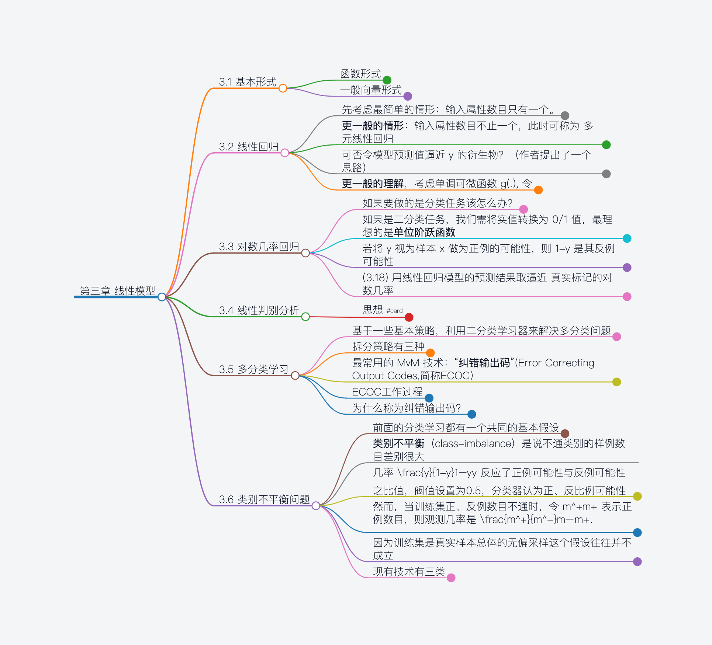

- # 第三章 线性模型  

	- #### 3.1 基本形式  
		- 函数形式  
			- $f(x) = w_1x_1 + w_2x_2 + ... + w_dx_d + b$  **(3.1)**  
		- 一般向量形式  
			- ​ $f(x) = w^Tx + b, 其中 w = (w_1; w_2; ...; w_d)$ . **(3.2)**  
	-  
	-  
	- #### 3.2 线性回归  
		- 先考虑最简单的情形：输入属性数目只有一个。  
			- 线性回归试图学得  
				- ​		 $f(x_i) = wx_i + b, 使得f(x_i) \simeq y_i$ 		**(3.3)**  
			- 如何确定 $w$ 和 $b$ ？使用均方误差作为这里的性能度量，目标是使均方误差最小化，即  
				- ​		 $(w^*,b^*) = \arg min_{(w,b)} \sum_{i=1}^{m}(y_i-wx_i-b)^2$ 		**(3.4)**  
		-  
			- 求解 $w$ 和 $b$ 使得 $E_{w,b} = \arg min_{(w,b)} \sum_{i=1}^{m}(y_i-wx_i-b)^2$ 值最小化的过程，称为线性回归模型的最小二乘“参数估计” (parameter estimation).  
			- 对 $E_{w,b}$ 分别对 $w$ 和 $b$ 求导，得到  
			- ​		//todo  
		-  
		- **更一般的情形**：输入属性数目不止一个，此时可称为 多元线性回归  
			- ​		 $\hat{w}^* = \arg min_{\hat{w}} (y-X\hat{w})^T(y-X\hat{w})$ 	 **(3.9)**  
			- 令 $E_{\hat{w}} = (y-X\hat{w})^T(y-X\hat{w})$ ,对 $\hat{w}$ 求导得到  
			- ​		 $\frac{\partial E_{\hat{w}}}{\partial \hat{w}} = 2X^T(X\hat{w}-y)$ 	**(3.10)**  
			- 令上式为零可得 $\hat{w}$ 的最优解的闭式解。  
		-  
		- 可否令模型预测值逼近 y 的衍生物？（作者提出了一个思路）  
			- 例如说，假设我们认为示例所对应的输出标记是在指数尺度上变化，那就可将输出标记的对数 作为线性模型逼近的目标，即  
			- ​		 $ln(y) = \hat{w}^Tx + b$ 	**(3.14)**  
			- 这就是**对数线性回归**，它实际上是试图让 $e^{\hat{w}^Tx+b}$ 逼近 y . **(3.14)**在形式上仍是线性回归，但实质上已是求取输入空间到输出空间的非线性函数映射，**这里的对数函数起到了将线性回归模型的预测值与真实标记联系起来的作用。**  
		-  
		- **更一般的理解**，考虑单调可微函数 g(.), 令  
			- ​		 $y = g^{-1}(\hat{w}^Tx + b)$ 		**(3.15)**  
			- 这样得到的模型称为“**广义线性模型**”（generalized linear model），其中函数g(.)称为“**联系函数**”（link function）  
			- 显然，对数线性回归是广义线性模型在 g(.) = ln(.) 时的特例  
	-  
	-  
	- #### 3.3 对数几率回归  
		- 如果要做的是分类任务该怎么办？  
			- 答案蕴含在式（3.5）的广义线性模型中：只需要找一个单调可微函数  
				- 将分类任务的真实标记 y 与线性回归模型的预测值练习起来  
		- 如果是二分类任务，我们需将实值转换为 0/1 值，最理想的是**单位阶跃函数**  
			- 但是，单位阶跃函数不连续，我们要找一个近似函数，且该函数单调可微  
				- **对数几率函数**logistic function 符合我们的要求, $y = \frac{1}{1+e^{-z}}$ **(3.17)**  
			- 将 (3.17) 代入 (3.15)，得到 $y = \frac{1}{1+e^{w^Tx+b}}$ **(3.18)**  
				- 转换变得为 $ln\frac{y}{1-y} = w^Tx+b$ **(3.19)**  
		- 若将 y 视为样本 x 做为正例的可能性，则 1-y 是其反例可能性  
			- 两者的比值 $\frac{y}{1-y}$ **(3.20)** 称为**几率** (odds)  
		- (3.18) 用线性回归模型的预测结果取逼近 真实标记的对数几率  
			- 其对应的模型称为“**对数几率回归**”（logistic regression）  
			- 名字是回归，实际却是一种分类学习方法，有很多优点  
				- 例如它是直接对分类可能 性进行建模，无需事先假设数据分布，这样就避免了假设分布不准确所带来的  
				  问题  
				- 可得到近似概率预测，这对许多需利用概 率辅助决策的任务很有用  
				- 有很好的数 学性质  
		-  
		-  
		-  
		-  
	-  
	-  
	- #### 3.4 线性判别分析  
		- 思想 #card  
			- 给定训练样例集，找到一条直线，同类样例投影到这条线的投影点尽可能接近、异类尽可能远离  
	-  
	-  
	- #### 3.5 多分类学习  
		- 基于一些基本策略，利用二分类学习器来解决多分类问题  
			- 拆解法，将多分类任务拆为若干个二分类任务求解  
				- 先对问题进行拆分，然后为拆出的每个二分类任务训练一个分类器  
				- 测试时，将各结果集成得到最终的多分类结果  
				- 关键是怎么拆分任务，如何对多个分类器进行集成  
		- 拆分策略有三种  
			- 一对一 One vs One  
				- 将这 N 个类别两两配对，从而产生 N(N-1)/2个二分类任务  
			- 一对其余 One vs Rest  
				- 每次将一个类的样例作为正例、所有其他类的样例做为反例来训练 N 个分类器  
			- 多对多 Mang vs Mang  
				- 每次将若干个类作为正类，若干个其他类作为反类  
		- 最常用的 MvM 技术：“**纠错输出码**”(Error Correcting Output Codes,简称ECOC)  
			- 将编码的思量引入类别拆分，并尽可能在解码过程中具有容错性  
		- ECOC工作过程  
			- 编码  
				- 对 N 个类别作 M 次划分  
				- 每次划分将一部分划为正类，一部分划为反类，从而形成一个二分类训练集  
				- 产生 M 个训练集，可训练出 M 个分类器  
			- 解码  
				- M 个分类器分别对测试样本进行预测，这些预测标记组成一个预测编码  
				- 将这个预测编码与每个类别各自的编码进行比较  
				- 返回其中距离最小的类别作为最终预测结果  
			- 类别划分通过**编码矩阵**（coding matrix）指定，常见的有二元码和三元码  
		- 为什么称为纠错输出码？  
			- 因为在测试阶段，ECOC编码对分类器的错误有一定的容忍和修正能力  
				- 某个学习器对某个样例算错了，不影响最小距离，仍能得到正确结果  
			- 一般 编码越长，纠错能力越强，同事需训练的分类器越多  
	-  
	-  
	- #### 3.6 类别不平衡问题  
		- 前面的分类学习都有一个共同的基本假设  
			- 不通类别的训练样例数目相当  
		- **类别不平衡**（class-imbalance）是说不通类别的样例数目差别很大  
		- 几率 $\frac{y}{1-y}$ 反应了正例可能性与反例可能性之比值，阀值设置为0.5，分类器认为正、反比例可能性相同  
			- 即决策规律为，若 $\frac{y}{1-y}$ 则 预测为正例 **（3.46）**  
		- 然而，当训练集正、反例数目不通时，令 $m^+$ 表示正例数目，则观测几率是 $\frac{m^+}{m^-}$ .  
			- 分类器的预测几率高于观测几率判定为正例  
				- 若 $\frac{y}{1-y} > \frac{m^+}{m^1}$ 则 预测为正例 **（3.47）**  
				- 使用基本策略——**再缩放**（rescaling）  
		- 因为训练集是真实样本总体的无偏采样这个假设往往并不成立  
			- 所以我们并不能基于观测几率来推断出真实几率  
		- 现有技术有三类  
			- **欠采样**（undersampling）  
				- 去除一些反例使得正、反例数目接近，然后再进行学习  
				- 代表性算法 EasyEnsemble，利用集成学习机制，将反例划分为若干个集合供不同学习器使用  
			- **过采样**（oversampling）  
				- 增加一些正例使得正、反例数目接近  
				- 代表性算法 SMOTE 通过对训练集里的正例进行插值来产生额外的正例  
			- **阀值移动**（threshold-moving）  
				- 令 $\frac{y^`}{1-y^`} = \frac{y}{1-y}*\frac{m^-}{m^+}$  
				- 这就是类别不平衡学习的一个基本策略——**再缩放**（rescaling）  
				- 再缩放 也是 **代价敏感学习**（cost-sensitive learning）的基础  
	-  