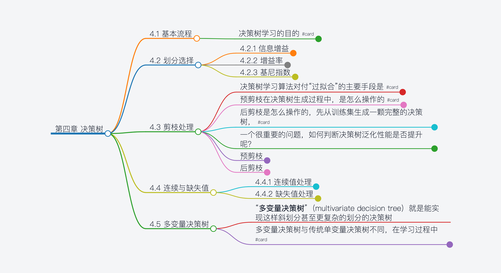
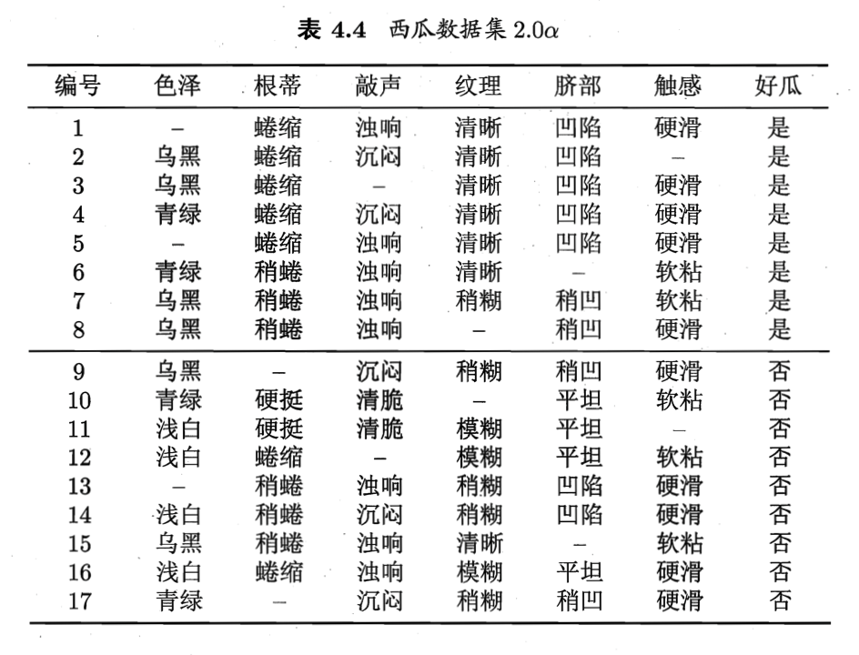

- # 第四章 决策树 

	- ## 4.1 基本流程  
		- 决策树学习的目的 #card  
			- 为了产生一个泛化能力强，即处理未见示例能力强的决策树，其基本流程遵循??策略 #card  
				- 简单且直观的“**分而治之**”策略  
			- 随着划分过程不断进行，我们希望决策树?? #card  
				- 决策树的分支节点所包含的样本尽可能属于同一类别，即结点的**纯度**（purity）越来越高  
	-  
	-  
	- ## 4.2 划分选择  
		- ### 4.2.1 信息增益  
			- 信息熵是度量样本集合??最常用的的一种指标 #card  
				- 纯度  
			- 信息熵的定义  
				- $Ent(D) = - \sum_{k=1}^{y}p_k log_2{p_k}$ **(4.1)**  
					- 集合 D 中第 k 类样本所占的比例为 $p_k$ (k = 1,2,...,|y|)  
				- Ent(D) 的值越小，则 D 的纯度越高  
			- 假定离散属性 a 有 V 个可能的取值 $${a^1,a^2,...,a^V}$$ 若使用 a 来对样本集 D 进行划分  
				- 则会产生 V 个分支结点，其中第 v 个分支结点包含了 D 中所在属性 a 上取值为 $a^v$ 的样本，记为 $D^v$  
			- 根据（4.1）计算出 $D^v$ 的信息熵  
				- 再考虑到不同的分支结点所包含的样本数不同,给分支结点赋予权重 $|D^v|/|D|$  
					- 即样本数越多的分支结点的影响越大  
				- 可计算出用属性 a 对样本集 D 进行划分所获得的“**信息增益**”（information gain）  
					- $Gain(D,a) = Ent(D) - \sum_{v=1}^V Ent(D^v)$ **(4.2)**  
			- 一般而言，信息增益越大，则意味着使用属性a来进行划分所获得的“纯度提升越大”  
				- 著名的 ID3 决策树学习算法就是以信息增益为准则来选择划分属性  
		- ### 4.2.2 增益率  
			- 信息增益准则对取值数目较多的属性有所偏好，为削弱这种偏好  
				- 著名的 C4.5 决策树算法使用**增益率**（gain ratio）来选择最优划分属性  
			- 增益率定义  
				- $Gain_ratio(D,a) = \frac{Gain(D,a)}{IV(a)}$ **(4.3)**  
				- 其中 $IV(a) = - \sum_{v=1}^{V} \frac{|D^v|}{|D|} log_2{\frac{|D^v|}{|D|}}$ **(4.4)**  
					- 称为属性 a 的**固有值**（intrinsic value）  
					- 属性 a 的可能取值数目越多（即V越大），则 IV(a) 的值通常会越大  
			- 需注意的是，增益率准则对可取值数目较少的属性有所偏好  
				- C4.5 算法并不是直接选择增益率最大的候选划分属性，而是使用了一个启发式：  
					- 先从候选划分属性中找出信息增益高于平均水平的属性，再从中选择增益率最高的  
		- ### 4.2.3 基尼指数  
			- CART 决策树使用”**基尼指数**“（Gini index）来选择划分属性  
				- $Gini(D) = \sum_{k=1}^{|y|}\sum_{k^` \neq k}p_k p_{k^`} = 1 - \sum_{k=1}^{|y|}{p_k^2}$ **(4.5)**  
				- $Gini(D)$ 反映了从数据集 D 中随机抽取两个样本，其类别标记不一致的概率  
					- 因此 基尼指数 越小，则数据集 D 的纯度越高  
			- 属性 a 的基尼指数定义为  
				- $Gini\_index(D,a) = \sum_{v=1}^{V}{\frac{|D^v|}{|D|}} Gini(D^v)$ **(4.6)**  
	-  
	-  
	- ## 4.3 剪枝处理  
		- 决策树学习算法对付“过拟合”的主要手段是 #card  
			- 剪枝（pruning），剪枝的基本策略有 #card  
				- 预剪枝(prepruning) 和 后剪枝(postpruning)  
		- 预剪枝在决策树生成过程中，是怎么操作的 #card  
			- 对每个结点在划分前先进行估计，  
			- 若当前结点的划分不能带来决策树泛化性能提升，则停止划分并将当前结点标记为叶结点  
		- 后剪枝是怎么操作的，先从训练集生成一颗完整的决策树， #card  
			- 然后自底向上地对非叶结点进行考察  
			- 若将该结点对应的子树替换为叶结点能带来决策树泛化性能提升，则将该子树替换为叶结点  
		- 一个很重要的问题，如何判断决策树泛化性能是否提升呢？  
			- 通过比较两个选择的 验证集精度来判断，精度提高说明提高了泛化性能  
		- 预剪枝  
			- 预剪枝基于贪心本质禁止这些分支展开，给预剪枝决策树带来欠拟合的风险  
		- 后剪枝  
			- 泛化性能往往优于预剪枝，但训练时间开销相对大得多  
	-  
	-  
	- ## 4.4 连续与缺失值  
		- ### 4.4.1 连续值处理  
			- 使用二分法对连续属性进行离散化处理，这是 C4.5 决策树算法中采用的机制  
			- 对于连续属性 a，我们可考察包含 n-1 个元素的候选划分点集合  
				- $T_a = \{\frac{a^i+a^{i+1}}{2} | 1 \leq a \leq n-1 \}$ **(4.7)**  
			- 把区间 $[a^i, a^{i+1}]$ 的中位点 $\frac{a^i+a^{i+1}}{2}$ 作为候选划分点，选取最优的划分点进行样本集合的划分  
			- 对**(4.2)**稍加改造  
				- $Gain(D, a) = max_{t \in T_a} Gain(D,a,t) = max_{t \in T_a} Ent(D) - \sum_{\lambda \in \{-,+\}}{\frac{D_t^{|\lambda|}}{|D|}Ent(D_t^{\lambda})}$ **(4.8)**  
				- 其中 $Gain(D,a,t)$ 是样本集 D 基于划分点 t 二分后的信息增益。  
					- 于是我们就可选择使 Gain(D,a,t) 最大化的划分点  
			-  
		- ### 4.4.2 缺失值处理  
			- 两个问题  
				- 如何在属性值缺失的情况下进行划分属性选择？  
				- 给定划分属性，若样本在该属性上的值缺失，如何对样本进行划分？#card  
					- 同时进入所有子分支，权重和子分支中完整属性在所有样本的比例保持一致  
			- 符号描述看着太复杂了，看例子  
			-   
			- 这里有17个样例，各样例权值均为1.  
			- 以属性“色泽”为例，拿到该属性的无缺失值样例子集14个样例{2,3,4,6,7,8,9,10,11,12,14,15,16,17}  
				- 计算其信息熵 $Ent(D) = -\sum_{k=1}^2{p_k log_2{p_k}} = -(\frac{6}{14}log_2{\frac{6}{14}} + \frac{8}{14}log_2{\frac{8}{14}}) = 0.985$  
				- 令 D^1,D^2,D^3 分别表示在属性“色泽”上取值为“青绿” “乌黑”以及“浅白”的样本子集，分别计算信息熵得到1、0.918、0  
				- 根据(4.12)计算 原始样本的信息增益为 $$Gain(D,色泽) = \frac{14}{17}*0.306 = 0.252 $$  
				- 当根据属性“纹理”划分时，{1,2,3,4,5,6,15}进入“清晰”，{7,9,13,14,17}进入“烧糊”，{11,12,16}进入“模糊”  
					- 而缺失样本{8}, 同时进入三个分支，权重在三个子结点中分别为 7/15 , 5/15 和 3/15；{10}同处理  
	-  
	-  
	- ## 4.5 多变量决策树  
		- “**多变量决策树**”（multivariate decision tree）就是能实现这样斜划分甚至更复杂的划分的决策树  
		- 多变量决策树与传统单变量决策树不同，在学习过程中 #card  
			- 不是为每个非叶结点寻找一个最优划分属性，而是试图建立一个合适的线性分类器  