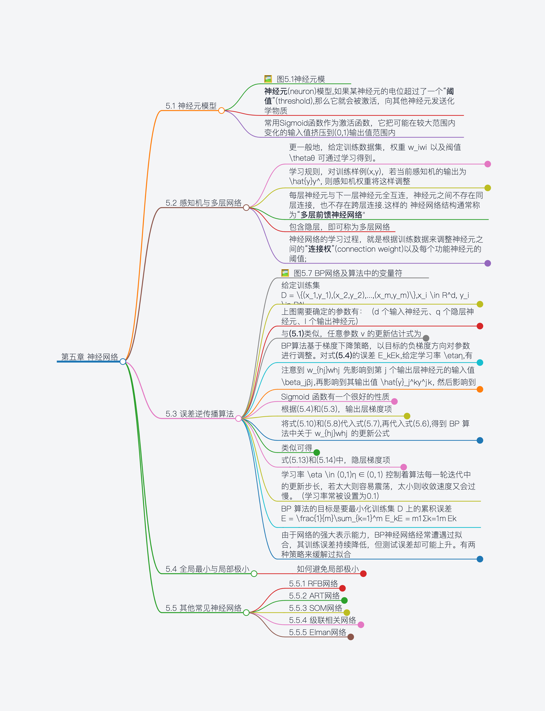
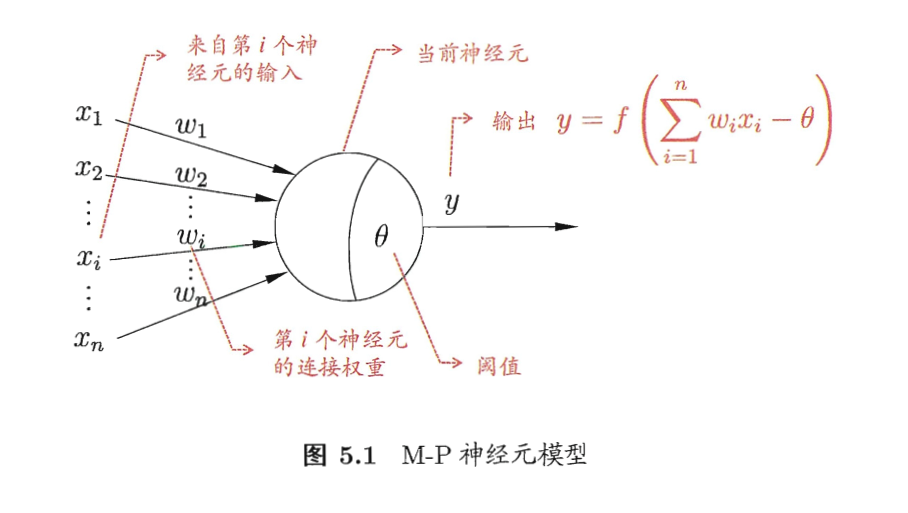
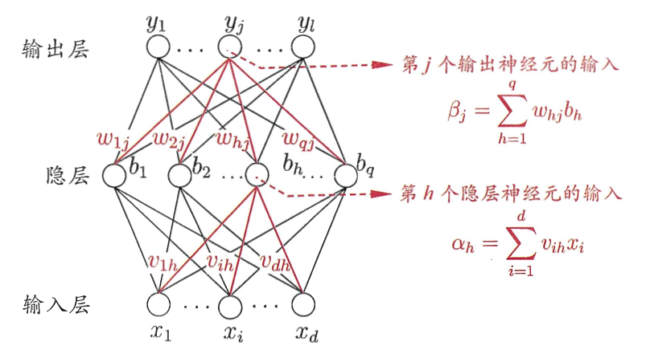

- # 第五章 神经网络  

-
-
	- ## 5.1 神经元模型  
		-   
		- **神经元**(neuron)模型,如果某神经元的电位超过了一个“**阈值**”(threshold),那么它就会被激活，向其他神经元发送化学物质  
		- 常用Sigmoid函数作为激活函数，它把可能在较大范围内变化的输入值挤压到(0,1)输出值范围内  
-  
-  
	- ## 5.2 感知机与多层网络  
		- 更一般地，给定训练数据集，权重 $w_i$ 以及阀值 $\theta$ 可通过学习得到。  
			- 阈值 $\theta$ 可看作一个固定输入为 -1.0 的**哑结点** (dummy node)所对应的连接权重 $w_{n+1}$ ,这样就统一为权重的学习。  
		- 学习规则，对训练样例(x,y)，若当前感知机的输出为 $\hat{y}$ , 则感知机权重将这样调整  
			- $w_i  \leftarrow w_i + \Delta w_i$ **(5.1)**  
			- $\Delta w_i = \eta(y-\hat{y})x_i$ **(5.2)**  
			- 其中 $\eta \in (0,1)$ 称为**学习率**（learning rate).  
		- 每层神经元与下一层神经元全互连，神经元之间不存在同层连接，也不存在跨层连接.这样的 神经网络结构通常称为“**多层前馈神经网络**"  
		- 包含隐层，即可称为多层网络  
		- 神经网络的学习过程，就是根据训练数据来调整神经元之间的“**连接权**”(connection weight)以及每个功能神经元的阈值;  
			- 换言之，神经网络“学”到的东西，蕴涵在连接权与阈值中  
-  
-  
	- ## 5.3 误差逆传播算法  
		-   
		- 给定训练集 $D = \{(x_1,y_1),(x_2,y_2),...,(x_m,y_m)\},x_i \in R^d, y_i \in R^l$  
		- 对于训练例 $(x_k,y_k)$ , 假定神经网络的输出为 $\hat{y_k} = (\hat{y}_1^k, \hat{y}_2^k,...,\hat{y}_l^k)$ ,即  
			- $\hat{y}_j^k = f(\beta_j - \theta_j)$ **(5.3)**  
		- 则网络在 $(x_k, y_k)$ 上的均方误差为  
			- $E_k = \frac{1}{2}\sum_{j=1}^l(\hat{y}_j^k - y_j^k)^2$ **(5.4)**  
		- 上图需要确定的参数有：（d 个输入神经元、q 个隐层神经元、l 个输出神经元）  
			- 输入层到隐层 d*q 个权值  
			- 隐层到输出层 q*l 个权值、q 个隐层神经元的阀值  
			- l 个输出层神经元的阀值  
		- 与**(5.1)**类似，任意参数 v 的更新估计式为  
			- $v \leftarrow v + \Delta v$ **(5.5)**  
		- BP算法基于梯度下降策略，以目标的负梯度方向对参数进行调整。对式**(5.4)**的误差 $E_k$ ,给定学习率 $\eta$ ,有  
			- $\Delta w_{hj} = - \eta \frac{\partial{E_k}}{\partial{w_{hj}}}$ **(5.6)**  
		- 注意到 $w_{hj}$ 先影响到第 j 个输出层神经元的输入值 $\beta_j$ ,再影响到其输出值 $\hat{y}_j^k$ , 然后影响到 $E_k$ ,有  
			- $\frac{\partial{E_k}}{\partial{w_{hj}}} = \frac{\partial{E_k}}{\partial{\hat{y}_j^k}} \frac{\partial{\hat{y}_j^k}}{\partial{\beta_j}} \frac{\partial{\beta_j}}{\partial{w_{hj}}}$ **(5.7)** 这就是链式法则  
			- 根据 $\beta_j$ 的定义，显然有  
				- $\frac{\partial{\beta_j}}{\partial{w_hj}} = b_h$ **(5.8)**  
				- $b_h$ 为隐层第h个神经元的输出  
		- Sigmoid 函数有一个很好的性质  
			- $f'(x) = f(x)(1-f(x))$ **(5.9)**  
		- 根据(5.4)和(5.3)，输出层梯度项 $g_j$  
			-  $g_j = -\frac{\partial{E_k}}{\partial{\hat{y}_j^k}} \frac{\partial{\hat{y}_j^k}}{\partial{\beta_j}} = -(\hat{y}_j^k-y_j^k)f'(\beta_j-\theta_j) = \hat{y}_j^k(1-\hat{y}_j^k)(y_j^k-\hat{y}_j^k) (5.10)$ - 将式(5.10)和(5.8)代入式(5.7),再代入式(5.6),得到 BP 算法中关于 $w_{hj}$ 的更新公式  
			- $\Delta w_{hj} =  \eta g_j b_h$ **(5.11)**， 其中 $w_{hj}$ 表示隐层第h个神经元到输出层第j个神经元的权重  
		- 类似可得  
			- $\Delta \theta_j = - \eta g_j$ **(5.12)**，其中 $\theta_j$ 表示输出层第j个神经元的阈值  
			- $\Delta v_{ih} = \eta e_h x_i$ **(5.13)**，其中 $v_{ih}$ 表示输入层第i个神经元到隐层第h个神经元的权重  
			- $\Delta \gamma h= -\eta e_h$ **(5.14)**，其中 $\gamma h$ 表示隐层第h个神经元的阈值  
		- 式(5.13)和(5.14)中，隐层梯度项 $e_h$  
			- $e_h = -\frac{\partial{E_k}}{\partial{b_h}} \frac{\partial{b_h}}{\partial{\alpha_h}} = b_h(1-b_h)\sum_{j=1}^l{w_{hj}g_j}$ **(5.15)**  
		- 学习率 $ η ∈ (0,1)$ 控制着算法每一轮迭代中的更新步长，若太大则容易震荡，太小则收敛速度又会过慢。（学习率常被设置为0.1）  
		- BP 算法的目标是要最小化训练集 D 上的累积误差 $E = \frac{1}{m}\sum_{k=1}^m E_k$ **(5.16)**  
		- 由于网络的强大表示能力，BP神经网络经常遭遇过拟合，其训练误差持续降低，但测试误差却可能上升。有两种策略来缓解过拟合  
			- 早停（early stopping）  
				- 分成训练集和验证集，若训练集误差降低但验证集误差升高，则停止训练，同时返回具有最小验证集误差的连接权和阈值  
			- 正则化（regularization）  
				- 其基本思想是在误差目标函数中增加一个用于描述网络复杂度的部分  
				- 例如连接权和阈值的平方和  
	-  
	-  
	- ## 5.4 全局最小与局部极小  
		- 如何避免局部极小  
			- 以多组不同参数值初始化多个神经网络，按标准方法训练后，取其误差最小的解  
			- 使用“模拟退火”（simulated annealing）技术.  
				- 模拟退火在每一步都以一定的概率接受比当前解更差的结果，从而有助于“跳出”局部极小。  
				- 在每一步迭代过程中，接收“次优解”的概率要随着时间的推移而逐渐降低，从而保证算法稳定  
			- 使用随机梯度下降。  
				- 随机梯度下降法在计算梯度时加入了随机因素，即使陷入局部极小点，它计算出的梯度仍可能不为零，这样就有机会跳出局部极小继续搜索  
			- 遗传算法  
			- 上述用于跳出局部极小的技术大多是启发式的，理论上还缺乏保障  
	-  
	-  
	- ## 5.5 其他常见神经网络  
		- ### 5.5.1 RFB网络  
			- RBF（Radial Basis Function，径向基函数）网络是一种单隐层前馈神经网络  
				- 它使用径向基函数作为隐层神经元激活函数  
				- 而输出层则是对隐层神经元输出的线性组合  
			- 公式表示为 $f(x) = \sum_{i=1}^q{w_i p(x,c_i)}$ **(5.18)**  
				- q为隐层神经元个数， $c_i和w_i$ 分别是第i个隐层神经元所对应的中心和权重，p(x,c_i)是径向基函数  
			- 常用两步过程训练法  
				- 确定神经元中心c_i，常用方式包括随机采样、聚类等  
				- 利用BP算法等来确定参数 $w_i$ 等  
		- ### 5.5.2 ART网络  
			- 竞争性学习（competitive learning）是神经网络中一种常用的无监督学习策略，  
				- 在使用此策略时，网络的输出神经元相互竞争，每一时刻仅有一个竞争获胜的神经元被激活，其他神经元抑制，胜者通吃原则  
			- ART（adaptive Resonance Theory，自适应谐振理论）网络是竞争性学习的代表  
				- 该网络由比较层、识别层、识别阈值和重置模块构成  
					- 比较层负责接收输入样本，并将其传递给识别层神经元  
					- 识别层每个神经元对应一个模式类，神经元数目可在训练过程中动态增 长以增加新的模式类.  
			- 竞争的方式  
				- 计算输入向量与每个识别层神经元所对应的模式 类的代表向量之间的距离，距离最小者胜.获胜神经元将向其他识别层神经元 发送信号，抑制其激活  
				- 若输入向量与获胜神经元所对应的代表向量之间的相 似度大于识别阈值  
					- 则当前输入样本将被归为该代表向量所属类别，同时，网络 连接权将会更新，使得以后在接收到相似输入样本时该模式类会计算出更大的 相似度，从而使该获胜神经元有更大可能获胜  
				- 若相似度不大于识别阈值  
					- 则重 置模块将在识别层增设一个新的神经元,其代表向量就设置为当前输入向量.  
			- 识别阈值对ART网络的性能有重要影响.  
				- 当识别阈值较高时,输入样 本将会被分成比较多、比较精细的模式类  
				- 当识别阈值较低，则会产生比 较少、比较粗略的模式类  
		- ### 5.5.3 SOM网络  
			- SOM（Self-Organizing Map，自组织映射）网络是一种竞争学习型的无监督神经网络  
				- 它能将高维输入数据映射到低维空间(通常为二 维)，同时保持输入数据在高维空间的拓扑结构  
			- 训练目标  
				- 为每个输出层神经元找到合适的权向量，以达到保持拓扑结构的目的.  
			- 训练过程  
				- 在接收到一个训练样本后，每个输出层神经元会计算该样本与自身携带的权向量之间的距离，距离最近的神经元成为竞争获胜者，称为最佳匹配单元(best matching unit)  
				- 然后，最佳匹配单元及其邻近神经元的权向量将被调整，以使得这些权向量与当前输入样本的距离缩小.这个过程不断迭代，直至收敛.  
		- ### 5.5.4 级联相关网络  
			- 结构自适应网络将网络结构也当作学习的目标之一，希望在训练过程中找到最符合数据特点的网络  
				- 这泛化能力感觉难搞  
			- 级联相关网络（Cascade-Correlation Network）是结构自适应网络的重要代表  
				- 两个重要组成部分，“级联”和“相关”  
					- 级联是指建立层次 连接的层级结构.  
					- 相关是指通过最大化新神经元的输出与网络误差之间的相关性(correlation)来训练相关的参数.  
			- 开始训练时只有输入层和输出层，处于最小拓扑结构  
			- 随着训练，新的隐层神经元加入，从而创建起层级结构  
		- ### 5.5.5 Elman网络  
			- 与前馈神经网络不同，递归神经网络（recurrent neural networks）允许网络中出现环形结构，从而可让一些神经元的输出反馈回来作为输入信号。  
				- 这样的结构与信息反馈过程，使得网络在t 时刻的输出状态不仅与t 时刻的输入有关，还与£- 1 时刻的网络状态有关，从而能处理与时间有关的动态变化.  