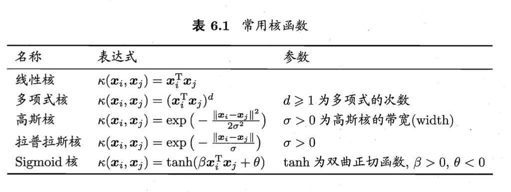
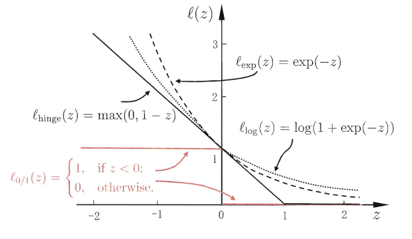

- # 第六章 支持向量机  
	- ## 6.1 间隔和支持向量  
		- 在样本空间中，划分超平面可通过线性方程来描述：  
			- $w^Tx + b = 0$ **(6.1)**  
			- 其中 $w = (w_1;w_2;...;w_d)$ 为法向量，决定了超平面的方向；  
			- b 为位移项，决定了超平面与原点之间的距离  
			- 超平面记为 (w,b)  
		- 样本空间中任意点 x 到超平面 (w,b) 的距离可写为  
			- $r = \frac{|w^Tx+b|}{||w||}$ **(6.2)**  
		- 假设超平面 (w,b) 能将训练样本正确分类，即对于 $(x_i,y_i) \in D$  
			- $w^Tx_i + b \ge +1, y_i=+1;  w^Tx_i + b \le -1, y_i = -1$ **(6.3)**  
		- 距离超平面最近的几个训练样本点使(6.3)的等号成立，它们被称为“**支持向量**”(support vector)  
			-  > ^^从直观上看，决策边界的宽度被最近的点支撑住，所以这些支撑点就被称为 支持向量 from-matongxue^^  

		- 两个异类支持向量到超平面的距离之和，被称为“**间隔**”(margin),^^也可叫决策边界宽度^^公式为  
			- $r = \frac{2}{||w||}$ **(6.4)**  
		- 目标是找到**最大间隔**（maximum margin）的划分超平面，即需最小化 $||w||^2$  
			- $min_{w,b}\frac{1}{2}||w||^2$  
			- $y_i(w^Tx_i + b) \ge 1, i = 1,2,...,m$ **(6.6)**  
			- 这就是支持向量机（Support Vector Machine，SVM）的基本型  
	-  
	-  
	- ## 6.2 对偶问题  
		- 对（6.6）使用拉格朗日乘子法可得到其“对偶问题”（dual problem）。具体操作：  
			- 对式（6.6）的每条约束添加拉格朗日乘子 $a_i \ge 0$ , 则得到拉格朗日函数  
				- $L(w,b,a) = \frac{1}{2}||w||^2 + \sum_{i=1}^m{a_i}(1-y_i(w^Tx_i+b))$ **(6.8)**  
				- 其中 $a = (a_1;a_2;...;a_m)$  
			- 令 L(w,b,a) 对 w 和 b 的偏导为0可得：  
				- $\frac{\partial L}{\partial w} =0 \rightarrow w = \sum_{i=1}^m{a_iy_ix_i}$ **(6.9)**  
				- $\frac{\partial L}{\partial b} = 0 \rightarrow 0 = \sum_{i=1}^m{a_i y_i}$ **(6.10)**  
			- 将（6.9）代入（6.8），即可消去 w 和 b，再考虑（6.10）的约束，可得到（6.6）的对偶问题  
				- $max_a \sum_{i=1}^m{a_i} - \frac{1}{2}\sum_{i=1}^m \sum_{j=1}^m a_ia_jy_iy_jx_i^Tx_j$ **(6.11)**  
				- s.t. $\sum_{i=1}^ma_iy_i = 0, a_i \ge 0, i = 1,2,...,m$  
				- ^^相对（6.6）而言，有两点改进^^  
					- (6.11)中没有w和b，这样求解比较简单  
					- (6.11)限制条件中 $\sum_{i=1}^n a_iy_i=0$ 很容易消去，限制条件只为简单的 $a_i \ge 0$ ， 极大的降低求解的难度  
				- ^^求解对偶算法的过程^^  
					- 1) 消去条件中的 $\sum_{i=1}^n a_iy_i=0$  
					- 2) 通过数据集D找到支持向量，根据拉格朗日乘数法以及KKT条件，有（下方6.12）  
					- 3) 通过支持向量求出决策边界  
			- 解出 a 后，求出 w 与 b 即可得到模型  
				- $f(x) = w^Tx + b = \sum_{i=1}^m a_i y_i x_i^T + b$ **(6.12)**  
			- 从对偶问题（6.11）解出来的 $a_i$ 是（6.8）中的拉格朗日乘子，它恰对应着训练样本 $(x_i,y_i)$ . 注意到（6.6）中有不等式约束  
				- 因此上述过程需满足 **KKT**（Karush-Kuhn-Tucker）条件，即要求  
					- $\begin{cases}a_i \ge 0; \\ y_if(x_i)-1 \ge 0; \\ a_i(y_if(x_i)-1)=0 \end{cases}$ **(6.13)**  
				- 于是，对任意训练样本(x_i,y_i)，总有 $a_i = 0$ 或者 $y_if(x_i) = 1$ .  
					- 若 $a_i = 0$ , 则该样本将不会在式（6.12）的求和中出现，也就不会对f(x)有任何影响  
					- 若 $a_i \ge 0$ , 则必有 $y_if(x_i)=1$ ,所对应的样本点位于最大间隔边界上，是一个支持向量。  
					- **这里显示出支持向量机的一个重性质：训练完成后，大部分的训练样本都不需要保留，最终模型仅与支持向量有关**  
				- 如何求解（6.11），这是个二次规划问题，可使用通用的二次规划算法来求解；规模大的话，需减小开销，使用些高效算法如**SMO**（Sequential Minimal Optimization）  
					- SMO 步骤...略  
	-  
	-  
	- ## 6.3 核函数  
		- 将样本从原始空间映射到一个合适的更高维的特征空间，使得样本在这个特征空间内线性可分  
		- 令 $\phi(x)$ 表示将 x 映射后的特征向量，则在特征空间中划分超平面所对应的模型可表示为  
			- $f(x) = w^T \phi(x) + b$ **(6.19)**  
		- 类似（6.6），有  
			- $min_{w,b}\frac{1}{2}||w||^2$ **(6.20)**  
			- s.t. $y_i(w^T \phi(x_i) +b) \ge 1, i = 1,2,...,m$  
		- 其对偶问题是  
			- $max_a \sum_{i=1}^m{a_i} - \frac{1}{2}\sum_{i=1}^m \sum_{j=1}^m a_ia_jy_iy_j \phi(x_i)^T \phi(x_j)$ **(6.21)**  
			- s.t. $\sum_{i=1}^ma_iy_i = 0$  
			- $a_i \ge 0, i=1,2,...,m$  
		- $\phi$ ^^为坐标转换函数，其点积^^ $\phi^T\phi$ ^^即为核函数^^  
		-  
		-  
		-   
		-  
	-  
	-  
	- ## 6.4 软间隔与正则化  
		- 硬间隔 要求所有样本都必须划分正确  
		- 软间隔 允许一些样本出错  
		- 优化目标可写为  
			- $min_{w,b} \frac{1}{2}||w||^2 + C\sum_{i=1}^m{l_{0/1}(y_i(w^Tx_i + b) - 1)}$ **(6.29)**  
			- 其中 C > 0 是一个常数， $l_{0/1}$ 是 “0/1损失函数”  
				- $l_{0/1}(z)=\begin{cases}1, if  z<0; \\ 0, otherwise\end{cases}$ **(6.30)**  
				- 显然，当 C 为无穷大时，(6.29) 迫使所有样本均满足约束（6.28），于是（6.29）等价于（6.6）  
				- 当 C 取有限值时，式（6.29）允许一些样本不满足约束  
			- 但是 $l_{0/1}$ 非连续，数学性质不太好，我们通常用其他一些函数来代替，被称为**替代损失**（surrogate loss)  
		- 三种常用替代损失函数  
			- hinge损失 $l_{hinge}(z) = max(0,1-z)$ **(6.31)**  
			- 指数损失（exponential loss） $l_{exp}(z) = exp(-z)$ **(6.31)**  
			- 对率损失（logistic loss） $l_log(z) = log(1+exp(-z))$ **(6.33)**  
		- 采用 hinge 损失，则（6.29）变成  
			- $min_{w,b} \frac{1}{2}||w||^2 + C\sum_{i=1}^m{max(0,(1 - y_i(w^Tx_i + b) ))}$ **(6.34)**  
			- 引入**松弛变量**（slack variables) $\xi_i \ge 0$ , （6.34）重写为  
				- $min_{w,b,\xi_i} \frac{1}{2}||w||^2 + C\sum_{i=1}^m{\xi_i}$ **(6.35)**  
			- 松弛变量代表 样本不满足约束的程度  
			-   
			- 通过拉格朗日乘子法可得到  
				- $L(w,b,a,\xi,\mu) = \frac{1}{2}||w||^2 + C \sum_{i=1}^m{\xi_i} + \sum_{i=1}^m{a}(1-\xi_i-y_i(w^Tx_i + b)) - \sum_{i=1}^m{\mu_i \xi_i}$ **(6.36)**  
					- 其中 $a_i \ge 0, \mu_i \ge 0$ 是拉格朗日乘子  
				- 令 $L(w,b,a,\xi, \mu)$ 对 w,b, $\xi_i$ 的偏导为零可得  
					- $w = \sum_{i=1}^m{a_iy_ix_i}$ **(6.37)**  
					- $0 = \sum_{i=1}^m{a_iy_i}$ **(6.38)**  
					- $C = a_i + \mu_i$ **(6.39)**  
				- 将式(6.37)-(6.39)代入式(6.36)即可得到式(6.35)的对偶问题  
					- $max_a{\sum_{i=1}^m}a_i - \frac{1}{2}\sum_{i=1}^m\sum_{j=1}^m a_i a_j y_i y_j x_i^T x_j$ **(6.40)**  
					- s.t. $\sum_{i=1}^ma_iy_i = 0$ , $0 \le a_i \le C, i = 1,2,...,m$  
				- 采用6.2节中同样的算法求解（6.40）；在引入核函数后得到与（6.24）同样的支持向量展式  
				- 类似（6.13），对软间隔支持向量机，KKT条件要求  
					- $\begin{cases} a_i \ge 0, \mu_i \ge 0, \\ y_if(x_i)-1+\xi_i \ge 0, \\ a_i(y_if(x_i)-1+\xi_i) = 0, \\ \xi_i \ge 0, \mu_i\xi_i = 0 \end{cases}$ **(6.41)**  
					-  
				-  
	-  